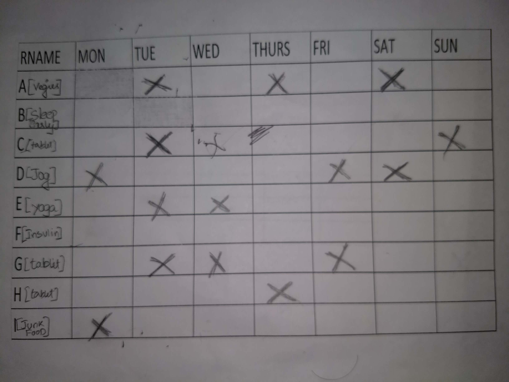
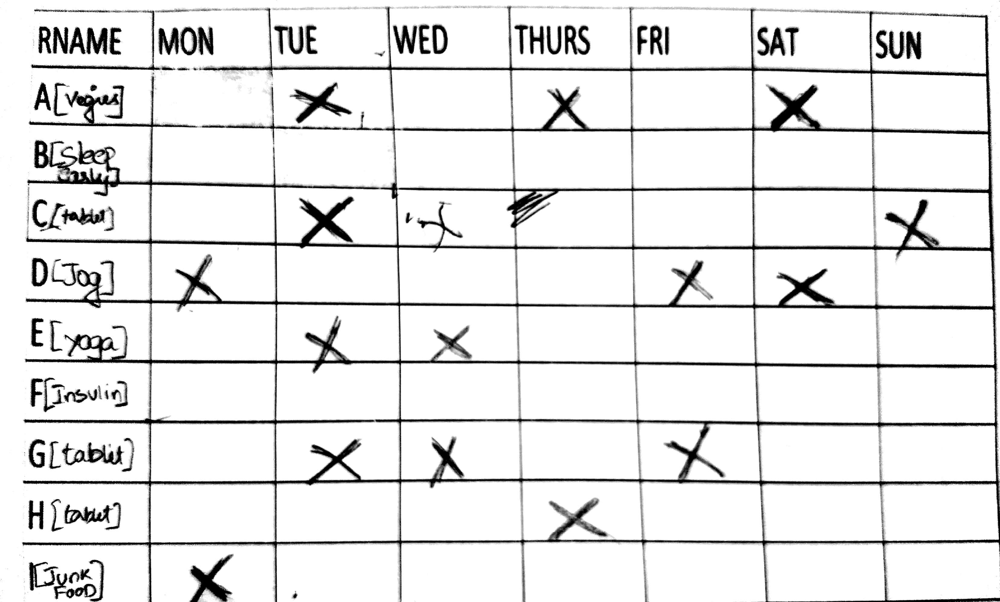
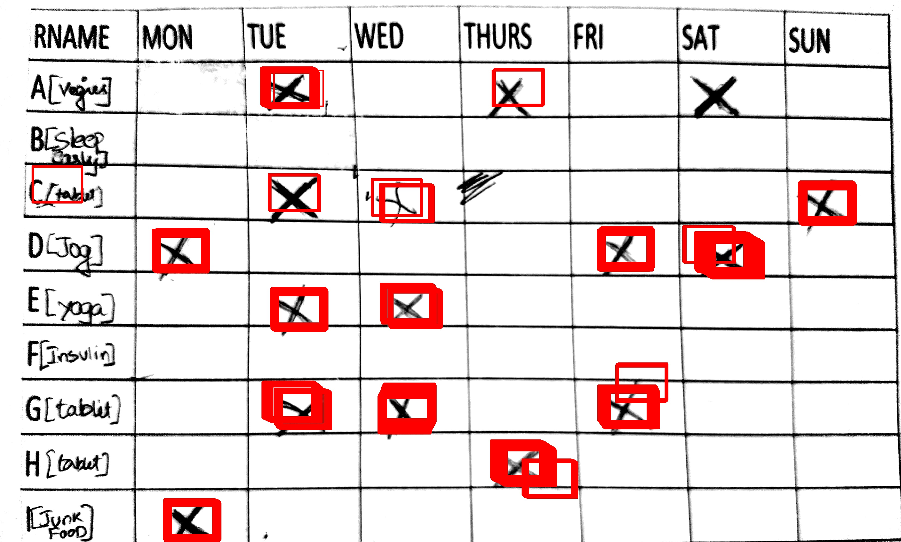

# What is the problem you’re solving?

Tremendous increase in the tech industry has made life simple for many but not all. There are people who still face issues catching up with the tech growth.

It becomes hard for the doctors to diagnosis certain problems of a patient without their constant monitoring of the patients activities. This application help them monitor their activities and helps the doctor find some crucial insights.

# Who are users and/or customers?

Old generation people who find it difficult to use computer system to upload their data. 

Inaddition our target users also include those young patients who are lazy enough to fill in the rows and columns of excel sheet in computer.

# What’s currently missing that they need and which your solution provides?

The missing factor is the simplicity. The solution is Image Processing. It becomes easy for the patient to just manually ‘mark’ in a sheet of paper and share it to the doctor through mobile picture. 

For the doctor, it becomes easy as he gets the statistical information of the patient data to come to a potential conclusion.

# How it works:

1. **Step1** : *Patient takes a photo of the filled in paper sheet and uploads it through an app*

2. **Step2** : *The application converts in image into grayscale version*

3. **Step3** : *the* **X** * trained pattern of the patient is matched to find the activity of the patient*

